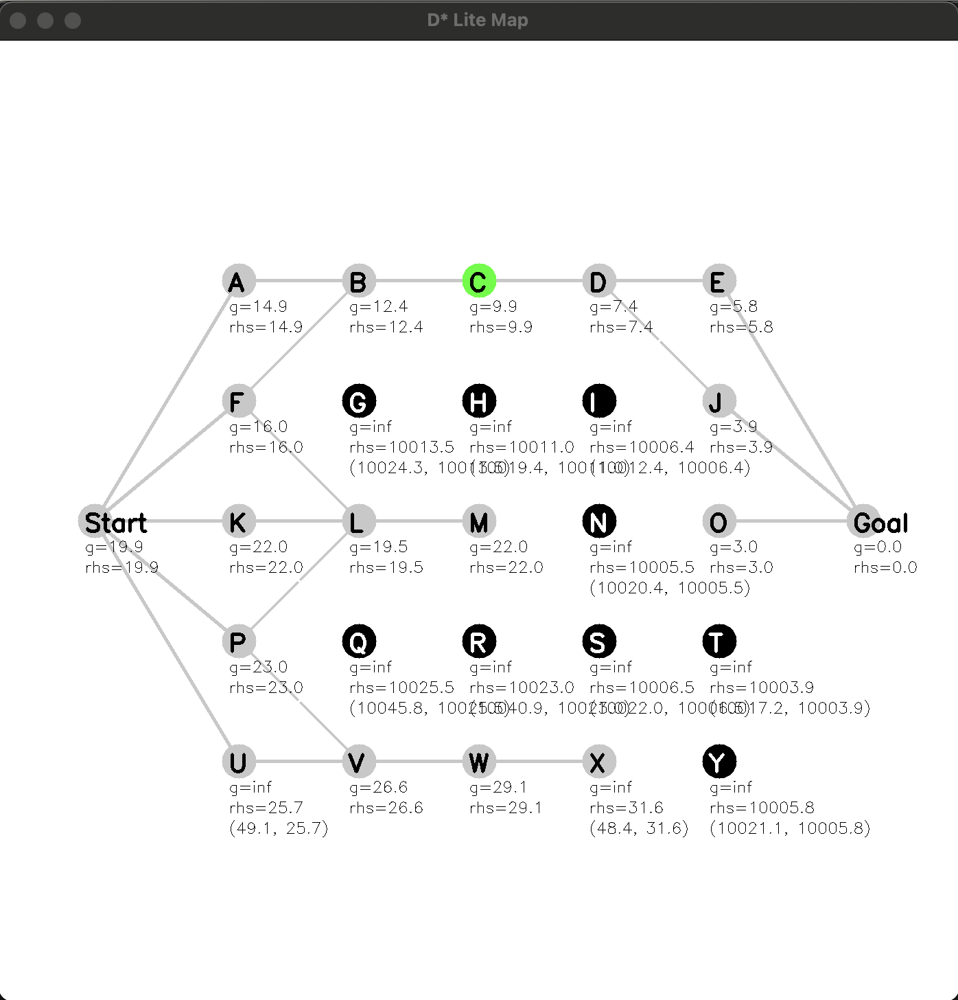
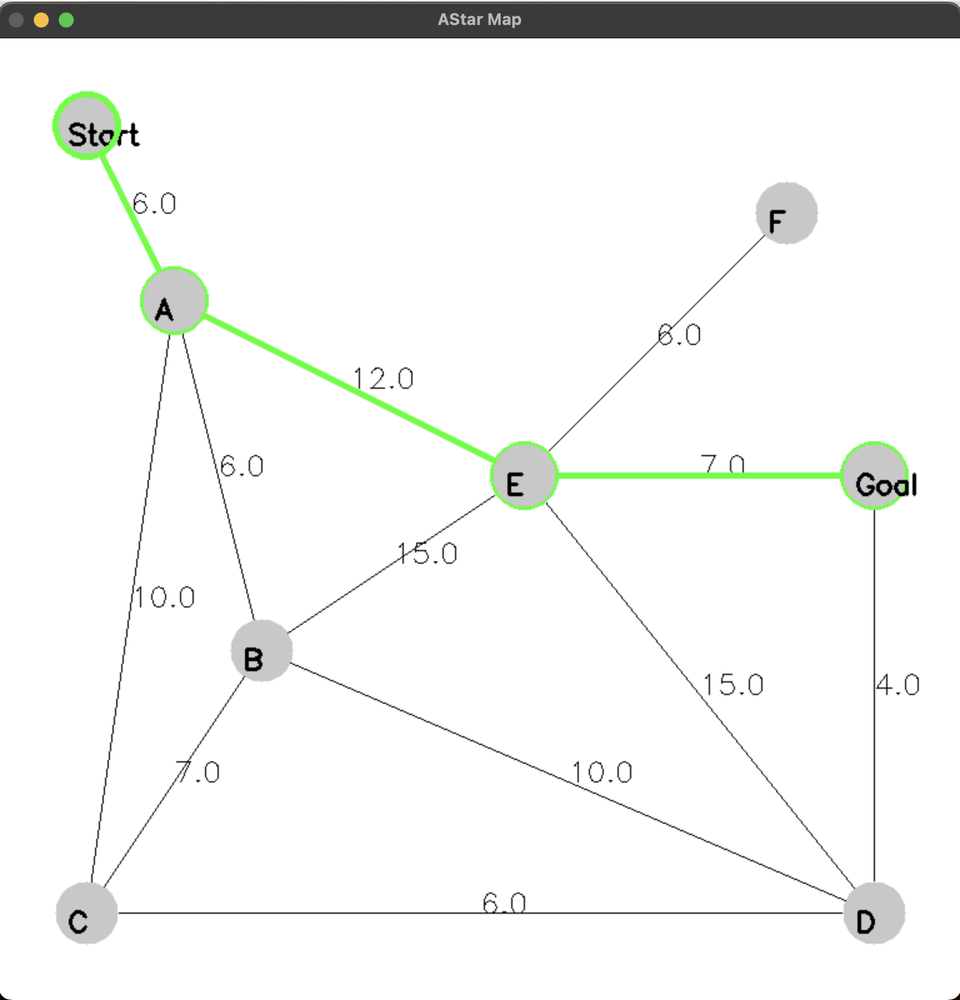

# Planning
A project that contains implementations of various planning algorithms in 2D. 

Requires OpenCV to display images, and YAML to read in config files.

* D* Lite 
	* Based on original D* Lite paper https://idm-lab.org/bib/abstracts/papers/aaai02b.pdf
	* `dStarLite` runs D* Lite on a hard-coded graph of 5 nodes, with a moving obstacle also hard-coded in
		* Text output only
	* `dStarLiteInteractive` and `dStarLiteOptimized` both run D* Lite on a graph of 25 nodes in a grid between Start and Goal Nodes
		* At each iteration, user is prompted to list nodes to become obstacles, or list nodes to stop being obstacles
		* Behavior should be identical, but dStarLiteInteractive uses the standard D* Lite algorithm and dStarLiteOptimized uses the optimized algorithm
		* Example output:

	

* A* 

	* `runAStar` reads in a graph from a yaml file and runs A* on it. Example output:
	
	
	
	* `aStarRandom` generates random nodes in between a start and goal node, and runs A*. Example output:
	
	

* RRT - Rapidly-Expanding Random Tree
	* `runRRT` reads in obstacles and a start and goal point from a yaml file and runs bi-directional RRT on it. Example output:

	


To build (from Planning directory):

```
mkdir build
cd build
cmake ..
make
```

Then run one of the following programs from the build folder. Type any key to close the image window and end the program.

```
./aStarRandom 
./dStarLite
./dStarLiteInteractive
./dStarLiteOptimized
./runAStar ../astar_params.yaml
./runRRT ../rrt_params.yaml
```

