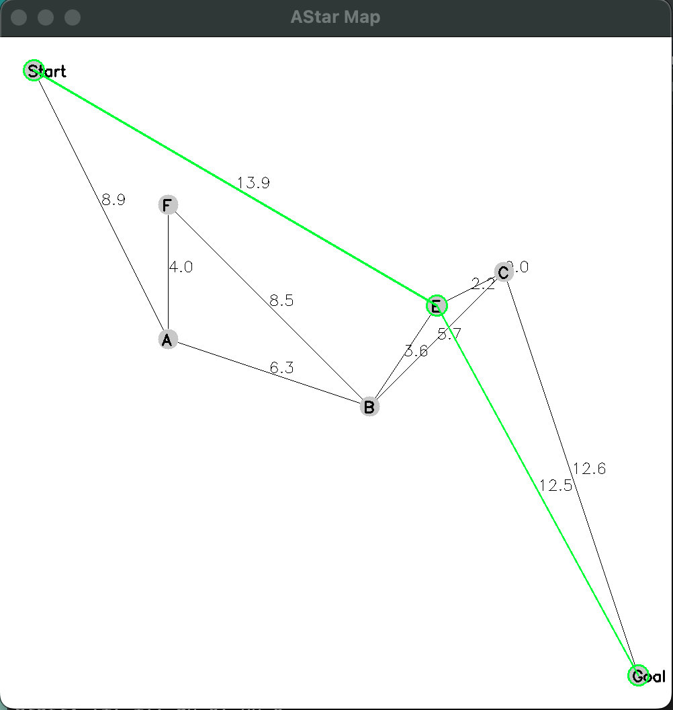

A project that contains implementations of various planning algorithms in 2D. Type any key to close the image window and end the program.
* A* 
	* runAStar reads in a graph from a yaml file and runs A* on it. Example output:
	
	
	
	* runAStarRandom generates random nodes in between a start and goal node, and runs A*. Example output:
	
	

* RRT - Rapidly-Expanding Random Tree
	* runRRT reads in obstacles and a start and goal point from a yaml file and runs bi-directional RRT on it. Example output:

	

* D* Lite 
	* runDStarLite runs D* Lite on a hard-coded graph of 5 nodes, with a moving obstacle also hard-coded in
	* Text output only so far

To build:

```
mkdir build
cd build
cmake ..
make
```

Then run one of the following programs from the build folder:

```
./aStarRandom 
./dStarLite # (gives text output only)
./runAStar ../astar_params.yaml
./runRRT ../rrt_params.yaml

```

